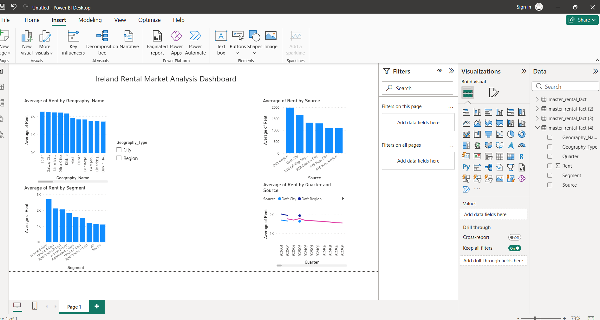
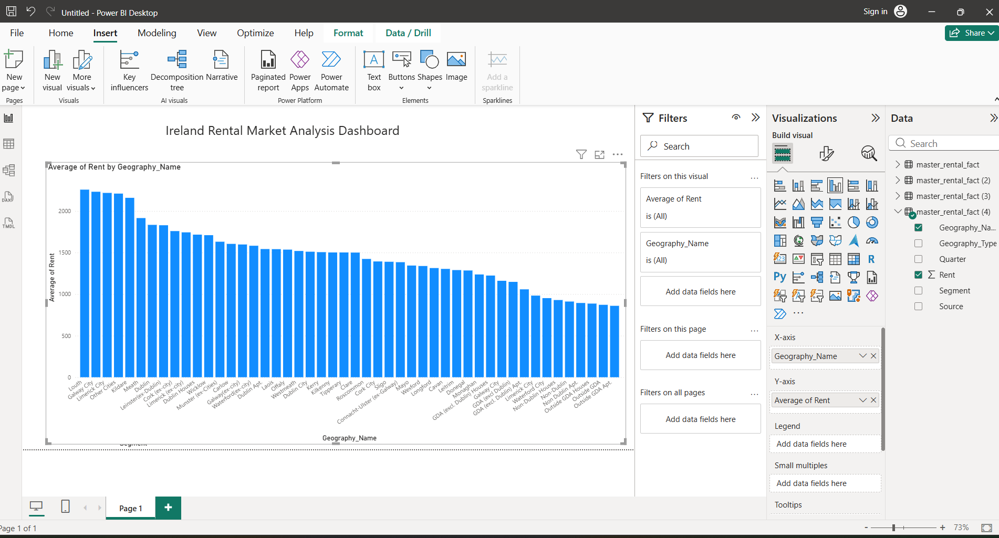
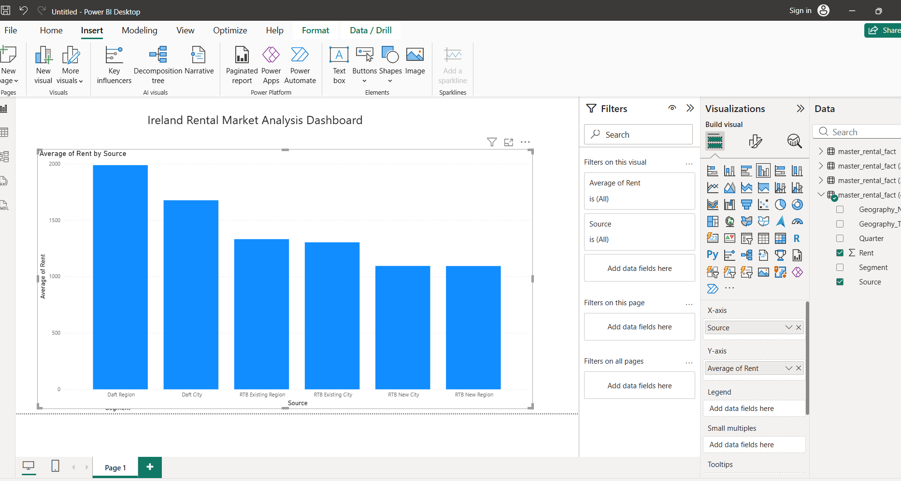
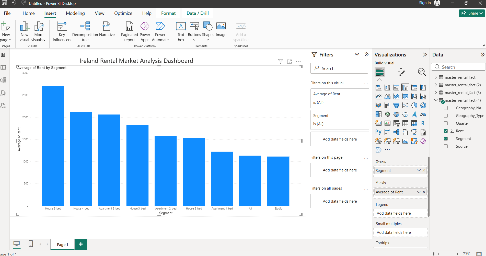
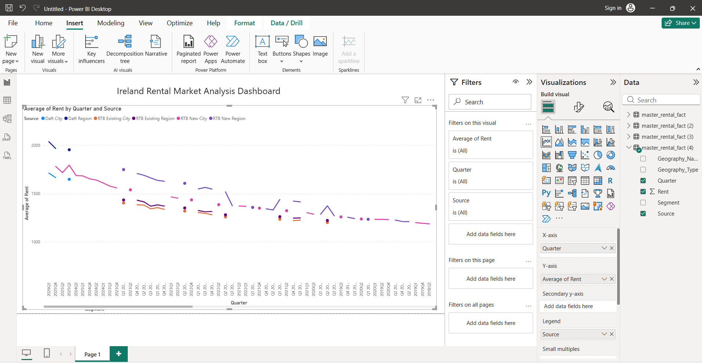

Ireland Rental Market Analysis

Project Overview

This project analyzes rental housing prices in Ireland using Python, SQL, and Power BI.
It explores rental price differences across cities, regions, and property types.

Tools Used

Python (Pandas, NumPy),
SQL (SQLite),
Power BI,
Data Visualization.

Workflow

Data cleaning using Python,
Data analysis using SQL,
Data transformation and aggregation,
Dashboard creation in Power BI,
Insight generation.

Key Insights

Dublin has the highest rental prices.
Regional differences are significant.
Property size affects rental cost.
Data sources show different pricing trends.

Dashboard Overview

Geography Analysis

Source Analysis

Segment Analysis

Trend Analysis

Skills Demonstrated

Data Cleaning & Processing,
SQL Analysis,
Dashboard Design (Power BI),
Data Visualization,
Business Insight Generation.

Author

Xu Qingfu

Engineering

